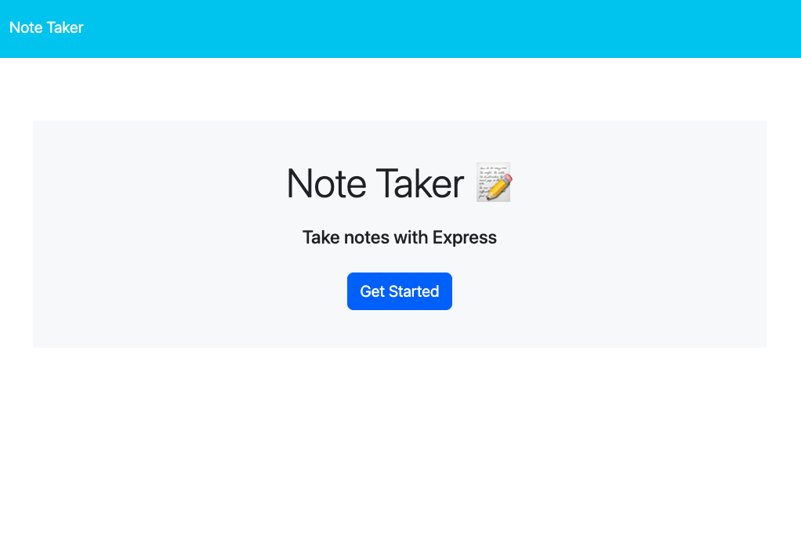
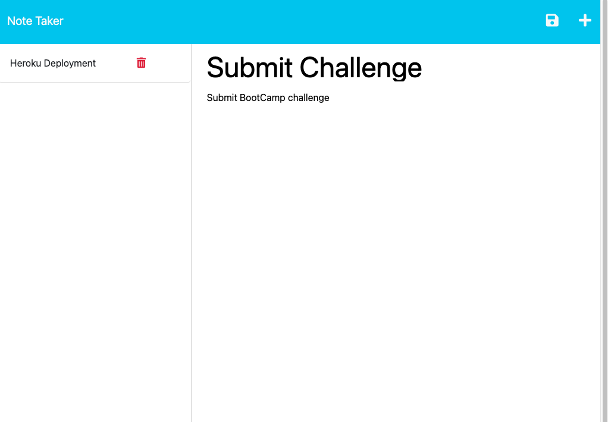
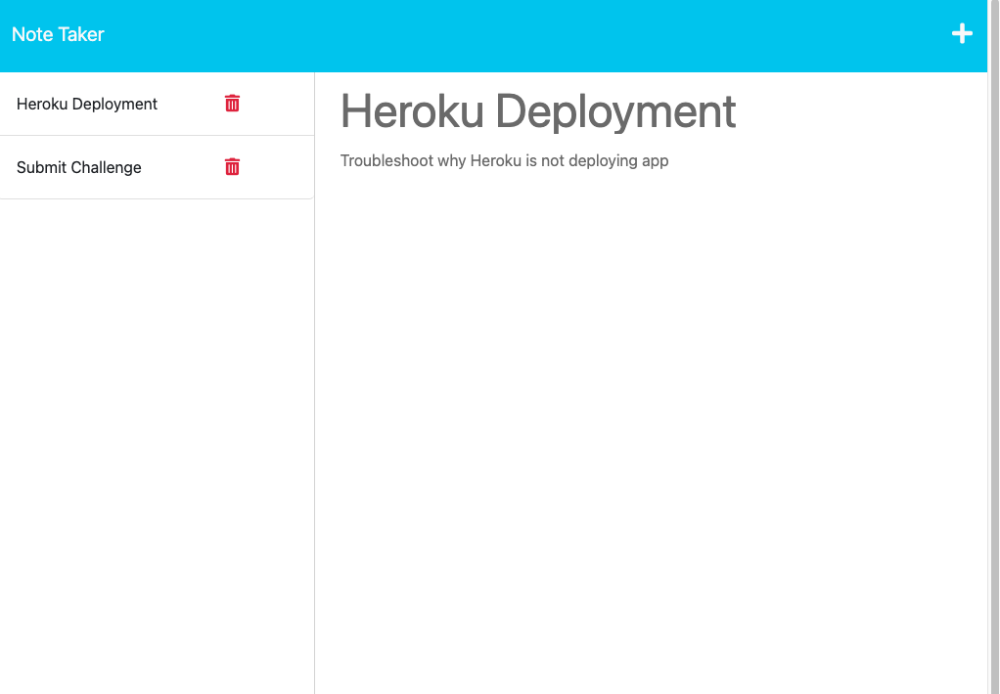

# Nodeja Kat Note Taker 
  
  

  ## DESCRIPTION
---
  An app to create, view, and delete notes!
  
  ## TABLE OF CONTENTS
---
  
  - [Usage](#usage)
  - [Resources](#resources)
  - [License](#license)
  - [Questions](#questions)

  
  
  ## USAGE
---
- Click the deployment link https://node-ja-kat-d2ae1bd63e1c.herokuapp.com/
- Click Get Started button
- Enter note title and text
- Click the save icon
- View note by clicking it in the list
- Delete note by clicking the trash icon
- Add new note by clicking the plus icon

  ## RESOURCES
---
1. The Full-Stack Bog (https://coding-boot-camp.github.io/full-stack/heroku/heroku-deployment-guide)
2. UConn Coding Bootcamp - Module 11 Express Mini Project
3. MDN (https://developer.mozilla.org/en-US/)
4. Stack Overflow (https://stackoverflow.co/)
5. UDEMY Jonas Schmedtmann courses (https://codingheroes.io/resources/)
6. UDEMY Dr Angela Yu (https://appbrewery.com/)
7. UDEMY Colt Steele and Stephen Grider - The Modern Javascript Bootcamp Course (2022) (https://www.udemy.com/course/javascript-beginners-complete-tutorial/)
8. W3Schools (https://www.w3schools.com/)

  ## LICENSE
---
  MIT

  

  

  ## QUESTIONS
---
  To see more of my work, please visit my GitHub page: https://github.com/slaysian
